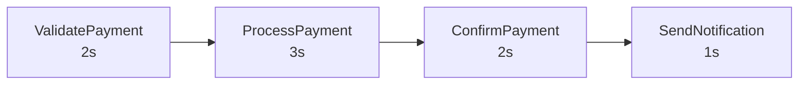
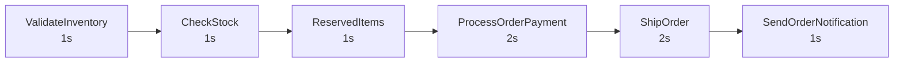
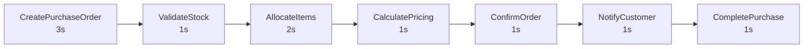
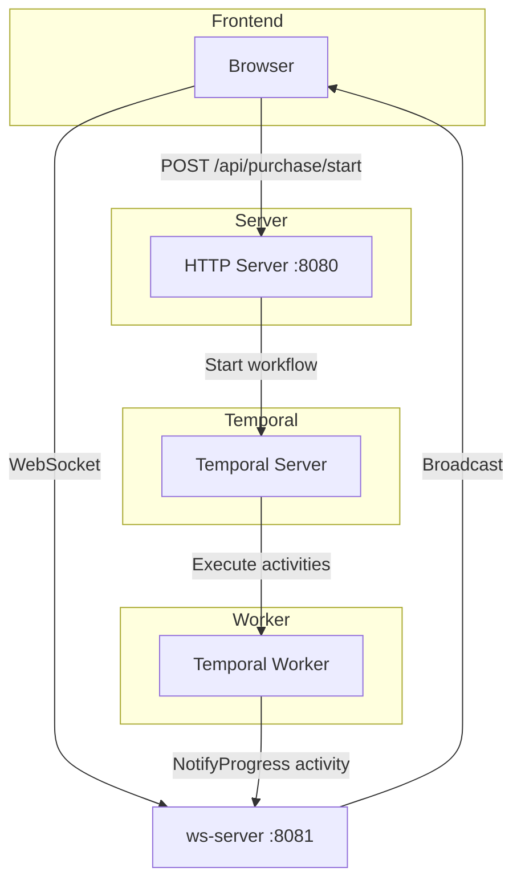
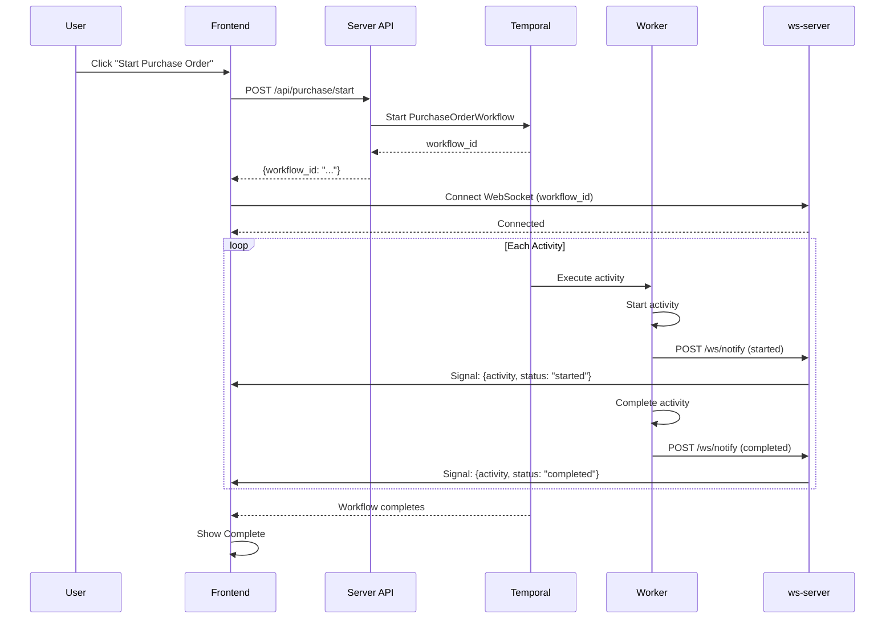
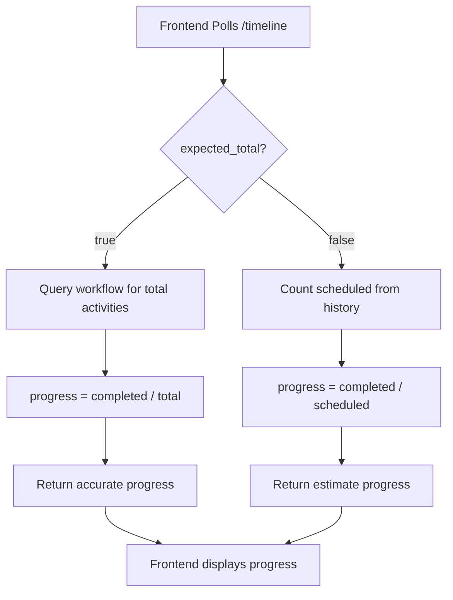
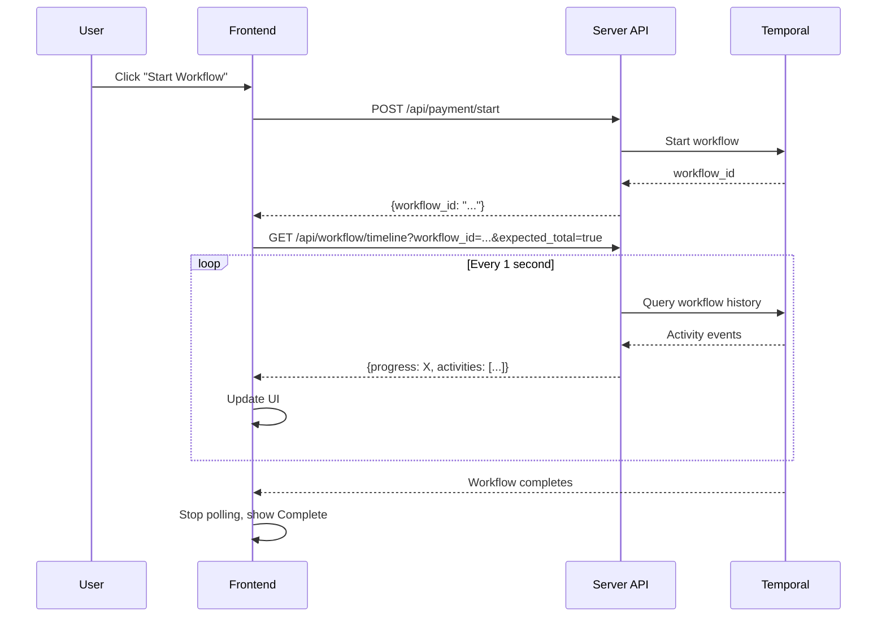
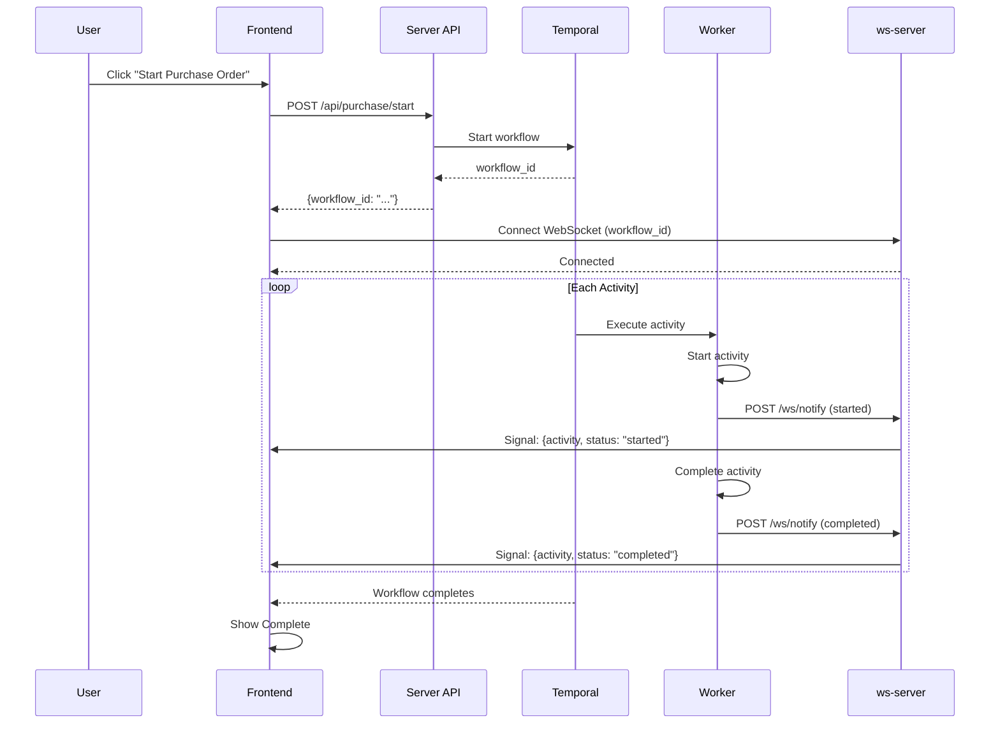

# Design

## Overview

Payment and Order processing workflows using Temporal for reliable, observable, long-running operations.

## Architecture

```
cmd/server/       — HTTP server (API + static frontend)
cmd/worker/       — Temporal worker (registers workflows/activities)
cmd/ws/           — WebSocket server (real-time updates)
activities/       — Activity implementations (non-deterministic)
workflow/         — Workflow definitions (deterministic)
internal/         — Shared types
```

## Frontend Routes

| Path | Description |
|------|-------------|
| `/` | Routing page - select Payment or Order workflow |
| `/payment` | Payment workflow UI |
| `/order` | Order workflow UI |
| `/ws-purchase` | Purchase Order UI (WebSocket real-time) |
| `/failing` | Failing workflow UI |

## Payment Workflow

### Flowchart



Total execution time: ~8 seconds.

### Activities

| Activity | Duration | Description |
|----------|----------|-------------|
| ValidatePayment | 2s | Validate order and payment details |
| ProcessPayment | 3s | Process payment with payment provider |
| ConfirmPayment | 2s | Confirm transaction |
| SendNotification | 1s | Send notification to customer |

### Activity Options

- StartToCloseTimeout: 2 minutes
- HeartbeatTimeout: 30 seconds
- Retry: Initial interval 1s, backoff 2x, max 5 attempts

## Order Fulfillment Workflow

### Flowchart



Total execution time: ~8 seconds.

### Activities

| Activity | Duration | Description |
|----------|----------|-------------|
| ValidateInventory | 1s | Validate order and inventory |
| CheckStock | 1s | Check stock availability |
| ReservedItems | 1s | Reserve items in warehouse |
| ProcessOrderPayment | 2s | Process payment |
| ShipOrder | 2s | Ship order to customer |
| SendOrderNotification | 1s | Send notification to customer |

## Purchase Order Workflow (WebSocket Real-time)

### Overview

The Purchase Order workflow demonstrates real-time progress updates using WebSocket. Unlike Payment and Order workflows which use polling, this workflow sends live updates to the frontend as each activity completes.

### Flowchart



Total execution time: ~10 seconds.

### Activities

| Activity | Duration | Description |
|----------|----------|-------------|
| CreatePurchaseOrder | 3s | Create purchase order record |
| ValidateStock | 1s | Validate stock availability |
| AllocateItems | 2s | Allocate items in warehouse |
| CalculatePricing | 1s | Calculate order pricing |
| ConfirmOrder | 1s | Confirm the order |
| NotifyCustomer | 1s | Send notification to customer |
| CompletePurchase | 1s | Finalize purchase |

### WebSocket Architecture



### How Real-time Updates Work



### Frontend Implementation

The Purchase Order page (`/ws-purchase`) uses WebSocket for real-time updates:

1. **Connect WebSocket** — After starting workflow, connects to ws-server with workflow_id
2. **Receive signals** — ws-server broadcasts activity updates to connected clients
3. **Display progress** — Shows activity log with status (started/completed/failed)
4. **No polling** — Updates are pushed in real-time, no need to poll timeline API

### WebSocket Server

The ws-server (`cmd/ws`) handles real-time communication:

- **`/ws?workflow_id=X`** — WebSocket connection endpoint
- **`/ws/notify`** — Receives activity notifications from worker
- **Broadcast** — Sends updates to all clients connected for a workflow

### NotifyProgress Activity

The workflow calls `NotifyProgress` activity after each step:

```go
func NotifyProgress(ctx context.Context, workflowID, activityName, status string, totalActivities int) error {
    // POST to ws-server /ws/notify
}
```

This activity:
1. Sends HTTP POST to ws-server with workflow_id, activity, status, total_activities
2. ws-server broadcasts to all connected WebSocket clients
3. Frontend receives and displays in activity log

### API Endpoints

#### POST /api/purchase/start

Start a purchase order workflow.

Request:
```json
{
    "order_id": "PO-123",
    "customer_id": "CUST-456",
    "items": ["Item1", "Item2"]
}
```

Response:
```json
{
    "workflow_id": "purchase-PO-123-xxx",
    "run_id": "xxx"
}
```

## API Endpoints

### POST /api/payment/start

Start a payment workflow.

Request:
```json
{
    "order_id": "ORD-123",
    "amount": 99.99,
    "customer_id": "CUST-456"
}
```

Response:
```json
{
    "workflow_id": "payment-ORD-123-xxx",
    "run_id": "xxx"
}
```

### POST /api/order/start

Start an order fulfillment workflow.

Request:
```json
{
    "order_id": "ORD-123",
    "customer_id": "CUST-456",
    "items": ["Item1", "Item2"]
}
```

Response:
```json
{
    "workflow_id": "order-ORD-123-xxx",
    "run_id": "xxx"
}
```

### POST /api/purchase/start

Start a purchase order workflow.

Request:
```json
{
    "order_id": "PO-123",
    "customer_id": "CUST-456",
    "items": ["Item1", "Item2"]
}
```

Response:
```json
{
    "workflow_id": "purchase-PO-123-xxx",
    "run_id": "xxx"
}
```

### GET /api/workflow/timeline?workflow_id=X

Get workflow timeline from history.

Response:
```json
{
    "workflow_id": "payment-ORD-123-xxx",
    "started_at_ms": 1778299327077,
    "ended_at_ms": 1778299335611,
    "progress": 100,
    "total_activities": 4,
    "activities": [...]
}
```

### GET /api/workflow/result?workflow_id=X

Get workflow result.

## Key Concepts

- **Workflow** — Deterministic execution, defines steps
- **Activity** — Non-deterministic operations (simulated with sleep)
- **Query handler** — Allows reading workflow state from outside without signals
- **Timeline API** — Reads workflow history to show activity progress
- **WebSocket** — Real-time updates for Purchase Order workflow

## Loading Progress

### Two Approaches

This project demonstrates two different approaches for showing workflow progress:

| Approach | Used By | Mechanism |
|----------|---------|-----------|
| **Polling** | Payment, Order, Failing | Frontend polls `/api/workflow/timeline` every 1s |
| **WebSocket** | Purchase Order | Real-time signals via ws-server |

### Polling Approach (Payment, Order, Failing)

#### Backend Implementation

The timeline API (`GET /api/workflow/timeline?workflow_id=X`) calculates progress based on completed activities.



**With `expected_total=true`:**

The API queries the workflow via a query handler (`wf.QUERY_TOTAL_SUBPROCESS`) to get the total number of activities upfront. Progress is calculated as:

```
progress = (completed_activities * 100) / total_activities
```

This provides accurate progress from the start (e.g., 0%, 25%, 50%, 75%, 100%).

**Without `expected_total` (default):**

The API only knows activities that have been scheduled so far (from workflow history). Progress is calculated as:

```
progress = (completed_activities * 100) / scheduled_count
```

This is less accurate at the beginning because:
- First poll: 1 scheduled, 0 completed → 0%
- Second poll: 2 scheduled, 1 completed → 50%
- Third poll: 3 scheduled, 2 completed → 66%

So without `expected_total`, progress jumps to ~50% once the second activity starts.

See `cmd/server/main.go:209` (`handleGetWorkflowTimeline`) and `cmd/server/main.go:36` (`buildTimelineFromHistory`).

#### Frontend Polling (workflow-app.js)



The frontend uses polling to fetch timeline/progress:

- `workflow-app.js` — Async/await polling loop with 1-second interval
- `runPollLoop()` fetches `/api/workflow/timeline` repeatedly until workflow completes or fails
- For workflows with known activity count (Payment, Order, Failing), `expected_total=true` is passed for accurate progress
- For dynamic/unknown workflows, default behavior is used

The polling approach ensures the UI stays updated without needing WebSockets or server push.

### WebSocket Approach (Purchase Order)



**How it works:**

1. **Frontend** connects to ws-server via WebSocket with workflow_id
2. **Worker** calls `NotifyProgress` activity after each step (started/completed/failed)
3. **NotifyProgress** sends HTTP POST to ws-server `/ws/notify`
4. **ws-server** broadcasts signal to all clients connected for that workflow_id
5. **Frontend** receives signal and updates activity log in real-time

**Advantages:**
- Real-time updates (no 1s delay)
- No polling overhead
- Accurate progress (total_activities passed in each signal)
