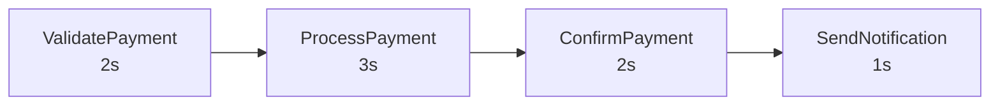

# Design

## Overview

Payment processing workflow using Temporal for reliable, observable, long-running operations.

## Architecture

```
cmd/server/       — HTTP server (API + static frontend)
cmd/worker/       — Temporal worker (registers workflows/activities)
activities/       — Activity implementations (non-deterministic)
workflow/         — Workflow definitions (deterministic)
internal/         — Shared types
```

## Payment Workflow

### Flowchart



Total execution time: ~8 seconds.

### Activities

| Activity | Duration | Description |
|----------|----------|-------------|
| ValidatePayment | 2s | Validate order and payment details |
| ProcessPayment | 3s | Process payment with payment provider |
| ConfirmPayment | 2s | Confirm transaction |
| SendNotification | 1s | Send notification to customer |

Total execution time: ~8 seconds.

### Activity Options

- StartToCloseTimeout: 2 minutes
- HeartbeatTimeout: 30 seconds
- Retry: Initial interval 1s, backoff 2x, max 5 attempts

## Data Types

### PaymentRequest

```go
type PaymentRequest struct {
    OrderID    string  `json:"order_id"`
    Amount    float64 `json:"amount"`
    CustomerID string `json:"customer_id"`
}
```

### PaymentResult

```go
type PaymentResult struct {
    TransactionID string `json:"transaction_id"`
    Status       string `json:"status"`
    Message     string `json:"message"`
}
```

### WorkflowStatus (query response)

```go
type WorkflowStatus struct {
    WorkflowID string `json:"workflow_id"`
    Progress int    `json:"progress"`    // 0-100
    Step     string `json:"step"`     // current step name
    Activity string `json:"activity"` // current activity
    Complete bool   `json:"complete"`
}
```

## API Endpoints

### POST /api/payment/start

Start a payment workflow.

Request:
```json
{
    "order_id": "ORD-123",
    "amount": 99.99,
    "customer_id": "CUST-456"
}
```

Response:
```json
{
    "workflow_id": "payment-ORD-123-xxx"
}
```

### GET /api/payment/progress?workflow_id=X

Query workflow progress.

Response:
```json
{
    "workflow_id": "payment-ORD-123-xxx",
    "progress": 50,
    "step": "ProcessPayment",
    "activity": "process-payment",
    "complete": false
}
```

## Key Concepts

- **Workflow** — Deterministic execution, defines steps
- **Activity** — Non-deterministic operations (simulated with sleep)
- **Query handler** — Allows reading workflow state from outside without signals