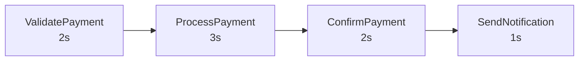
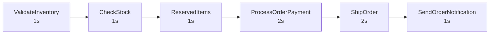

# Design

## Overview

Payment and Order processing workflows using Temporal for reliable, observable, long-running operations.

## Architecture

```
cmd/server/       — HTTP server (API + static frontend)
cmd/worker/       — Temporal worker (registers workflows/activities)
activities/       — Activity implementations (non-deterministic)
workflow/         — Workflow definitions (deterministic)
internal/         — Shared types
```

## Frontend Routes

| Path | Description |
|------|-------------|
| `/` | Routing page - select Payment or Order workflow |
| `/payment` | Payment workflow UI |
| `/order` | Order workflow UI |

## Payment Workflow

### Flowchart



Total execution time: ~8 seconds.

### Activities

| Activity | Duration | Description |
|----------|----------|-------------|
| ValidatePayment | 2s | Validate order and payment details |
| ProcessPayment | 3s | Process payment with payment provider |
| ConfirmPayment | 2s | Confirm transaction |
| SendNotification | 1s | Send notification to customer |

### Activity Options

- StartToCloseTimeout: 2 minutes
- HeartbeatTimeout: 30 seconds
- Retry: Initial interval 1s, backoff 2x, max 5 attempts

## Order Fulfillment Workflow

### Flowchart



Total execution time: ~8 seconds.

### Activities

| Activity | Duration | Description |
|----------|----------|-------------|
| ValidateInventory | 1s | Validate order and inventory |
| CheckStock | 1s | Check stock availability |
| ReservedItems | 1s | Reserve items in warehouse |
| ProcessOrderPayment | 2s | Process payment |
| ShipOrder | 2s | Ship order to customer |
| SendOrderNotification | 1s | Send notification to customer |

## API Endpoints

### POST /api/payment/start

Start a payment workflow.

Request:
```json
{
    "order_id": "ORD-123",
    "amount": 99.99,
    "customer_id": "CUST-456"
}
```

Response:
```json
{
    "workflow_id": "payment-ORD-123-xxx",
    "run_id": "xxx"
}
```

### POST /api/order/start

Start an order fulfillment workflow.

Request:
```json
{
    "order_id": "ORD-123",
    "customer_id": "CUST-456",
    "items": ["Item1", "Item2"]
}
```

Response:
```json
{
    "workflow_id": "order-ORD-123-xxx",
    "run_id": "xxx"
}
```

### GET /api/workflow/timeline?workflow_id=X

Get workflow timeline from history.

Response:
```json
{
    "workflow_id": "payment-ORD-123-xxx",
    "started_at_ms": 1778299327077,
    "ended_at_ms": 1778299335611,
    "progress": 100,
    "total_activities": 4,
    "activities": [...]
}
```

### GET /api/workflow/timeline-with-total-subprocess?workflow_id=X

Get workflow timeline with total activities from query handler.

Response:
```json
{
    "workflow_id": "order-ORD-123-xxx",
    "started_at_ms": 1778299301380,
    "ended_at_ms": 1778299317270,
    "progress": 100,
    "total_activities": 6,
    "activities": [...]
}
```

### GET /api/workflow/result?workflow_id=X

## Key Concepts

- **Workflow** — Deterministic execution, defines steps
- **Activity** — Non-deterministic operations (simulated with sleep)
- **Query handler** — Allows reading workflow state from outside without signals
- **Timeline API** — Reads workflow history to show activity progress
